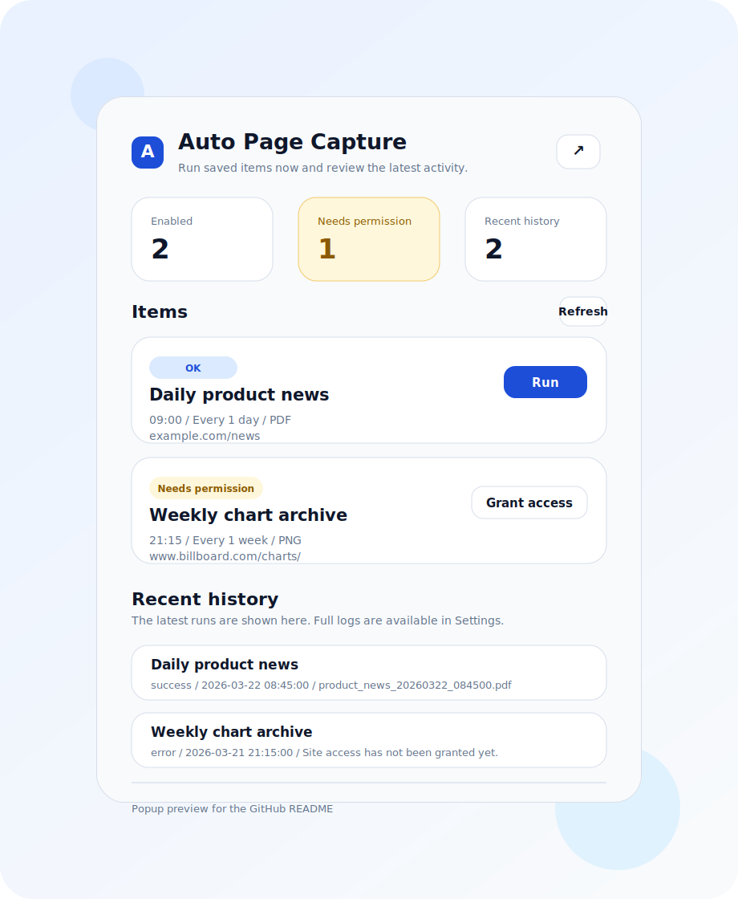
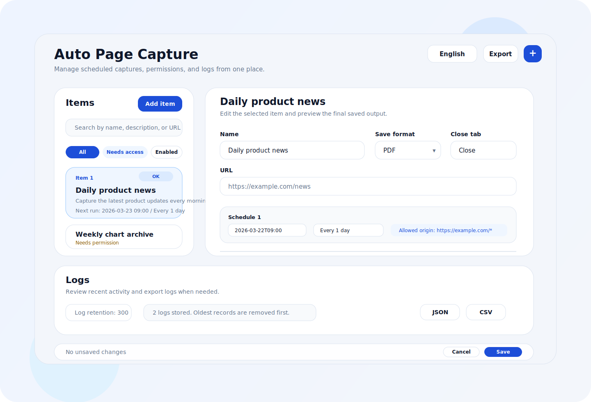

# Auto Page Capture

Auto Page Capture is a Manifest V3 browser extension for Microsoft Edge and Google Chrome.

It opens a target page on a schedule, optionally performs pre-save actions, and saves the result to your local downloads folder as MHTML, HTML, PDF, or a full-page image.

## Screenshots

| Popup                                         | Settings                                           |
| --------------------------------------------- | -------------------------------------------------- |
|  |  |

## Why This Extension Exists

Many pages are only useful after they finish loading, after a button is clicked, or after a small interaction updates the page.

This extension is built for that workflow:

- open a page automatically
- wait for the right state
- click or fill what is needed
- save the final result in a format you can keep locally

## Features

- Multiple capture items with independent schedules
- Manual run from the popup
- Automatic scheduled capture with `chrome.alarms`
- Pre-save actions such as:
  - wait
  - click by visible text
  - click by CSS selector
  - click by XPath
  - set an input value
  - wait for an element or attribute state
- Save formats:
  - `MHTML`
  - `HTML`
  - `PDF`
  - `PNG`
  - `JPEG`
  - `WebP`
- Full logs in the settings page
- Recent history in the popup
- Log export as JSON or CSV
- Per-site permission grant and revoke from the settings page
- UI language switching

## Save Formats

- `MHTML`: single-file web archive
- `HTML`: DOM snapshot of the current page state
- `PDF`: rendered through the browser print pipeline
- `PNG / JPEG / WebP`: full-page screenshot captured through the browser debugger API

## Privacy

This extension saves captured pages to local downloads only.

- No external server upload
- No cloud sync
- No built-in remote analytics

## Permissions

The extension uses these permissions for the following reasons:

- `storage`: save items, settings, recent history, and logs
- `alarms`: run scheduled captures
- `downloads`: save files locally
- `tabs`: open and manage target tabs
- `scripting`: run optional pre-save actions in the page
- `pageCapture`: create MHTML captures
- `debugger`: create PDF and full-page image captures
- `optional_host_permissions`: request site access only for target origins you register

## Typical Flow

1. Create an item in the settings page
2. Set the target URL
3. Choose a save format
4. Add one or more schedules
5. Add optional pre-save actions
6. Grant site access for the target origin
7. Save the configuration
8. Run it manually from the popup or let the schedule trigger it

## Load Unpacked

Load the extension from the `src` directory.

### Chrome

1. Open `chrome://extensions`
2. Enable Developer mode
3. Click `Load unpacked`
4. Select the `src` folder

### Microsoft Edge

1. Open `edge://extensions`
2. Enable Developer mode
3. Click `Load unpacked`
4. Select the `src` folder

## Development

Install dependencies:

```bash
npm install
```

Run lint:

```bash
npm run lint
```

Auto-fix lint issues where possible:

```bash
npm run lint:fix
```

Format the project:

```bash
npm run format
```

If PowerShell blocks `npm`, use `npm.cmd` instead.

## Repository Layout

- `src/`: extension source
- `docs/`: screenshots and store-description source files

## Notes

- PDF and image capture require the `debugger` permission
- PDF or image capture can fail while DevTools is attached to the same tab
- Site permission changes apply immediately
- Other settings are applied when you press `Save`
- Logs are capped by the configured log limit

## License

MIT
